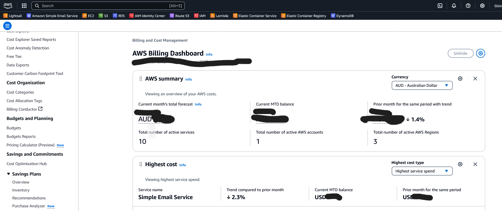
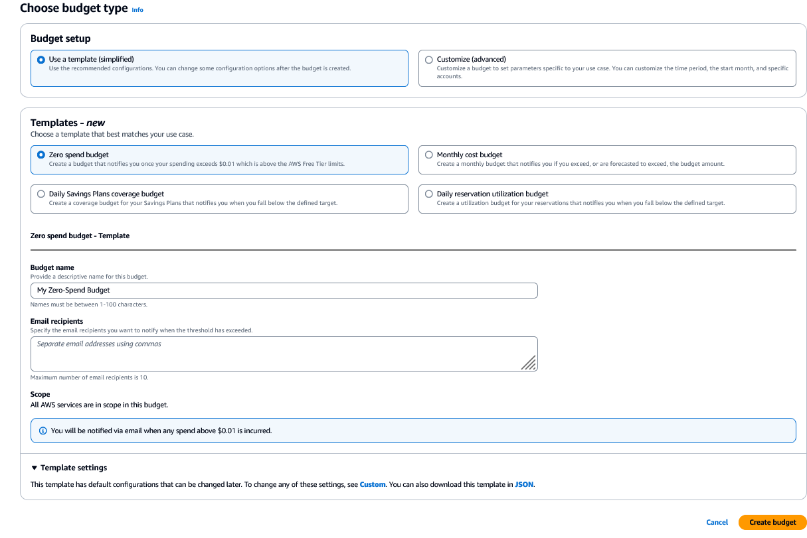

# Creating a budget

Creating a budget in AWS helps you monitor your costs and usage, ensuring you stay within your financial plans. Here's a step-by-step guide to creating an AWS budget:

1. **Sign in to the AWS Management Console:**
   - Navigate to the [AWS Budgets console](https://console.aws.amazon.com/billing/home).

2. **Select Budgets**
   - On the left option, select . 

3. **Create a new budget**
   - To create a budget you have to either use a template or create a custom budget.
   - For the purpose of learning in Free Tier create a `Zero Spend Budget`.
   
   . 

4. **Enter Alert Recipients:**
   - Provide email addresses to receive alert notifications.
   - You can add multiple recipients if needed.

7. **Review and Create:**
   - Review all the details of your budget.
   - Click "Create budget" to finalize and activate your budget.

After completing these steps, you'll have an active AWS budget that will help you manage and control your spending more effectively.
