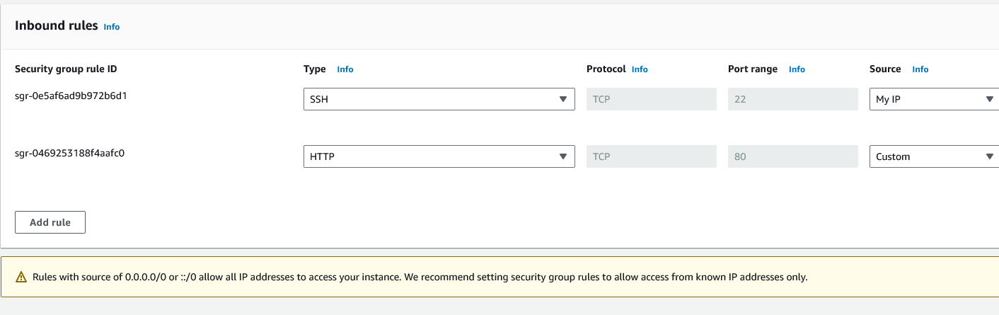
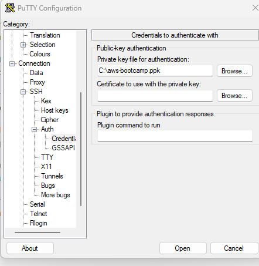

1. Launch an EC2 instance

2. Make sure you select AMI and Instance types for the free tier

3. Create a new key pair, use `.ppk` if you use putty else `.pem` if you use openssh/

 

4. Enable port 22 for your IP address in the security group

5. Configure Putty to load the private key

6. Once the instance is in running state you can ssh into the instance

