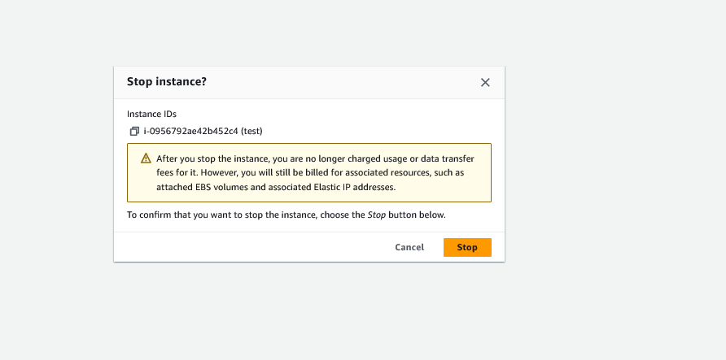

1. Verify the public IP of the EC2 instance


2. Verify the public DNS name of the EC2 instance

```bash

ec2-13-232-38-98.ap-south-1.compute.amazonaws.com

```

3. Visit the page using the public DNS 


4. stop the instance and start it again




5. Verify the Public IP address and DNS name of the EC2 instance. Is it still the same?

