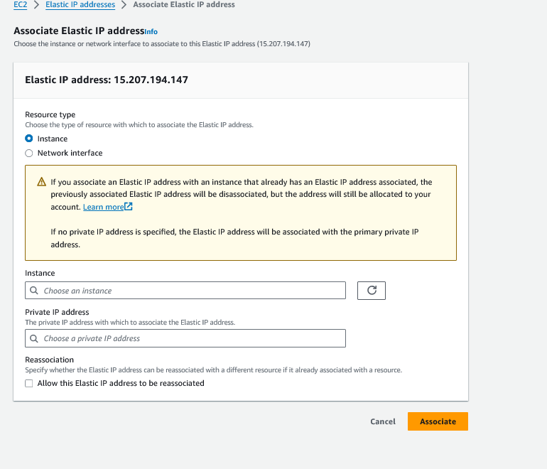

# Assigning Elastic IP addresses

1. Click on Allocate Elastic IP address - this will provide you with an Elastic IP address.

2. Associate elastic IP address

    - There are several ways you can associate IP address 
        - Instance 
        - Network Interface

Select instance in this case.

3. Reboot the EC2 instance , to validate if the IP address has been disassociated