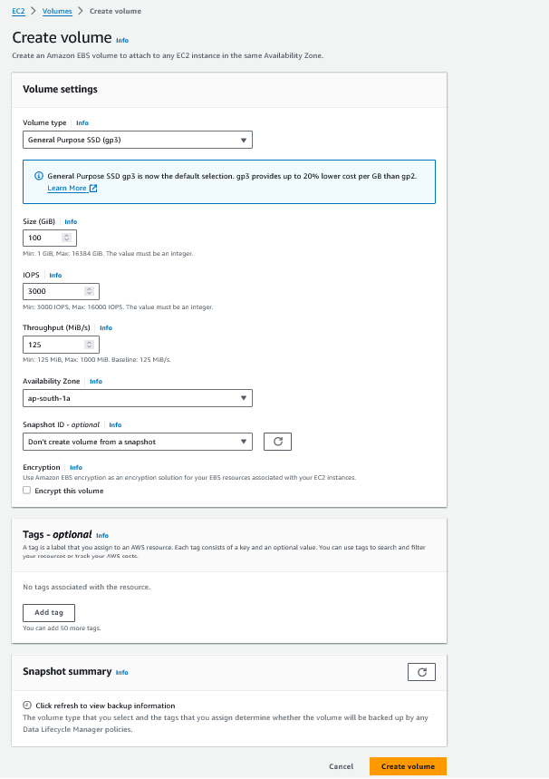
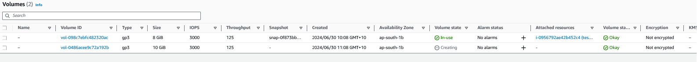
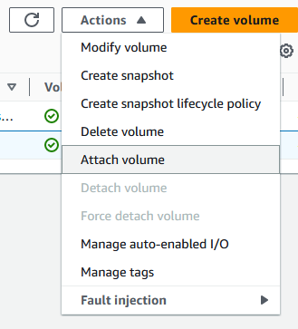
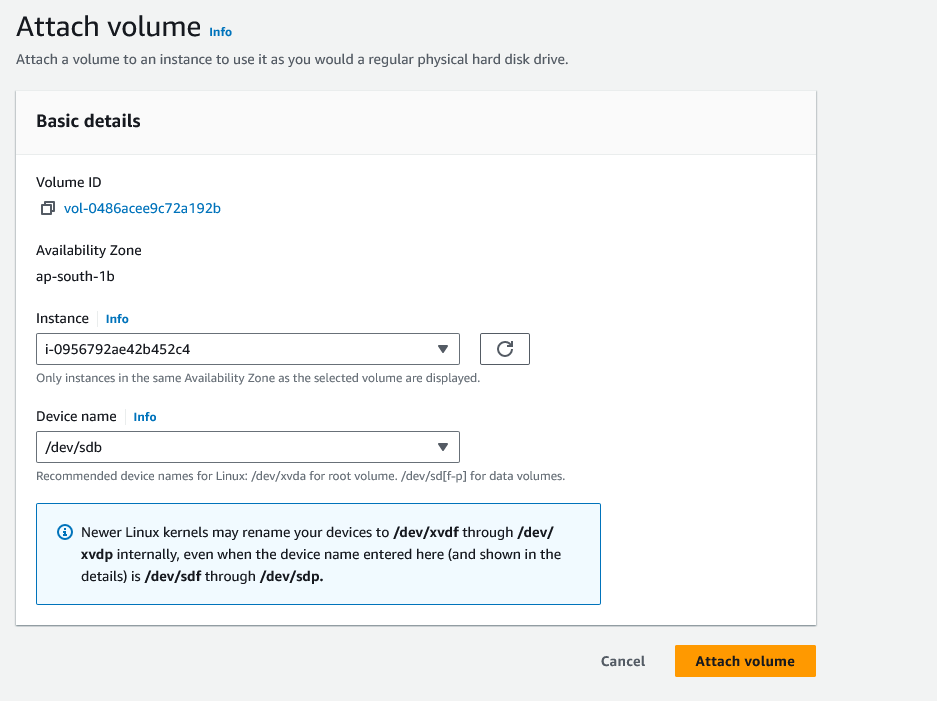

# Attaching an EBS instance


1. Create a new EBS volume , by selecting the option from the left menu EBS Volume -> Create EBS Volume (top right)


2. Provide the details such as size, IOPS  and volume type



3. Once the volume is created and in ready state, you can attach it to the instance




4. Click on attach the volume



5. Attach the volume to the instance



6. Check the disk status in the instance


```bash


[ec2-user@ip-172-31-1-185 ~]$ sudo fdisk -l
Disk /dev/xvda: 8 GiB, 8589934592 bytes, 16777216 sectors
Units: sectors of 1 * 512 = 512 bytes
Sector size (logical/physical): 512 bytes / 512 bytes
I/O size (minimum/optimal): 512 bytes / 512 bytes
Disklabel type: gpt
Disk identifier: 8B1BA8F1-7445-4C33-BE2B-040036A18CCC

Device       Start      End  Sectors Size Type
/dev/xvda1   24576 16777182 16752607   8G Linux filesystem
/dev/xvda127 22528    24575     2048   1M BIOS boot
/dev/xvda128  2048    22527    20480  10M EFI System

Partition table entries are not in disk order.


Disk /dev/xvdb: 10 GiB, 10737418240 bytes, 20971520 sectors
Units: sectors of 1 * 512 = 512 bytes
Sector size (logical/physical): 512 bytes / 512 bytes
I/O size (minimum/optimal): 512 bytes

```

The above print shows the disk `/dev/xvdb` is attached. we need to format it and mount it

7. Format and mount the disk , validate if you can create file in the ebs volume

```bash

[ec2-user@ip-172-31-1-185 ~]$ sudo mkfs.ext4 /dev/xvdb
mke2fs 1.46.5 (30-Dec-2021)
Creating filesystem with 2621440 4k blocks and 655360 inodes
Filesystem UUID: 9392d943-5249-4651-8f16-76174e23f9df
Superblock backups stored on blocks:
        32768, 98304, 163840, 229376, 294912, 819200, 884736, 1605632

Allocating group tables: done
Writing inode tables: done
Creating journal (16384 blocks): done
Writing superblocks and filesystem accounting information: done

[ec2-user@ip-172-31-1-185 ~]$ sudo mkdir /mnt/ebs
[ec2-user@ip-172-31-1-185 ~]$
[ec2-user@ip-172-31-1-185 ~]$ sudo mount /dev/xvdb /mnt/ebs
[ec2-user@ip-172-31-1-185 ~]$
[ec2-user@ip-172-31-1-185 ~]$ ls /mnt/ebs
lost+found
[ec2-user@ip-172-31-1-185 ~]$
[ec2-user@ip-172-31-1-185 ~]$ cd /mnt/ebs
[ec2-user@ip-172-31-1-185 ebs]$
[ec2-user@ip-172-31-1-185 ebs]$ touch hello-world-ebs-file
touch: cannot touch 'hello-world-ebs-file': Permission denied
[ec2-user@ip-172-31-1-185 ebs]$ sudo touch hello-world-ebs-file
[ec2-user@ip-172-31-1-185 ebs]$ ls -lrt
total 16
drwx------. 2 root root 16384 Jun 30 01:14 lost+found
-rw-r--r--. 1 root root     0 Jun 30 01:15 hello-world-ebs-file

```