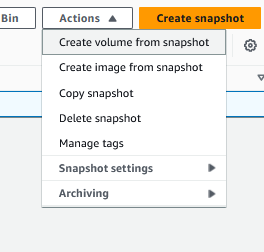
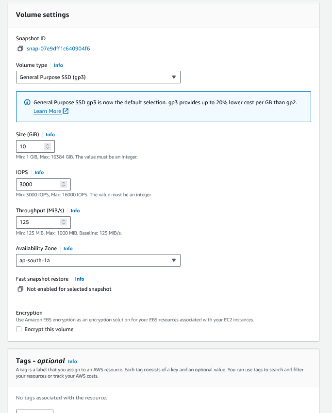

# Create snapshot of an EBS volume

1. To take a snapshot, click on create snapshot for the EBS volume

2. The snapshot might take some time

3. Once the volume snapshot is done, you can detach the EBS volume

4. Delete the volume

5. Once the volume is deleted, you can try to restore from the snapshot

6. Once the volume is restored, you can attach it to the instance
