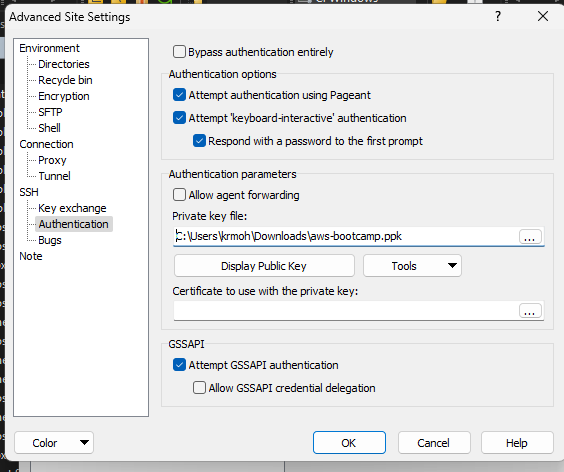
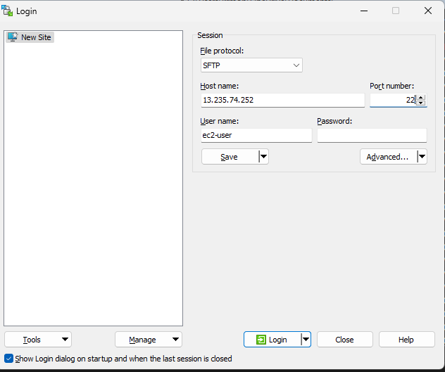
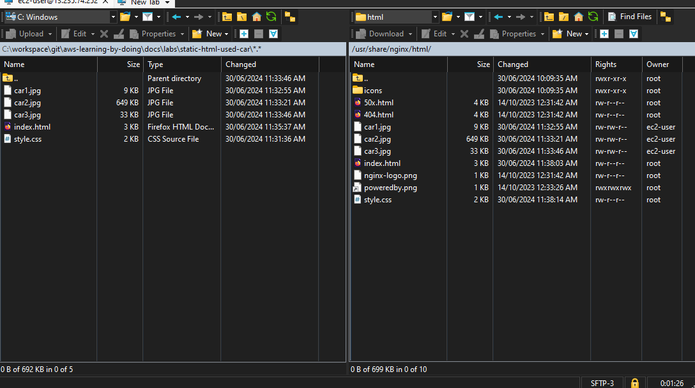

# Static website lab

In this lab, you'll learn how to use SFTP (Secure File Transfer Protocol) to upload a static website to an EC2 instance. SFTP is a secure way to transfer files between a local machine and a remote server.

1. Download and install winscp or you can also use scp copy command to upload the files.

2. Files are located at path "docs\labs\static-html-used-car". Download it from [here](labs/static-html-used-car/static-website.zip)

3. Upload the files to the EC2 instance using SFTP at the path "/usr/share/nginx/html". Make sure that the path has required permissions

```bash

[ec2-user@ip-172-31-1-185 nginx]$ sudo chown ec2-user:ec2-user html

```

4. Configure the private key in SFTP



5. Configure winscp



6. Upload the files




7. Visit the Public DNS 

