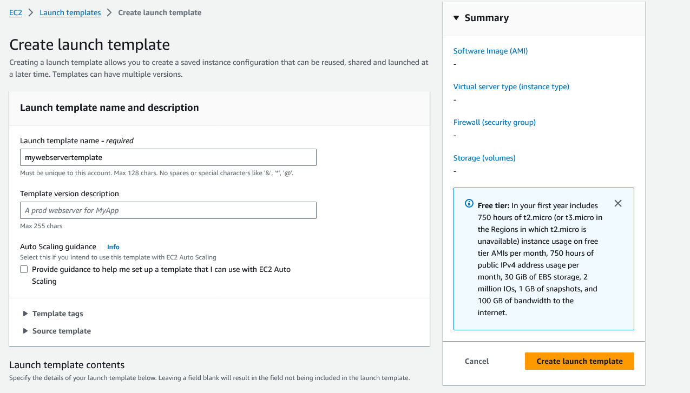
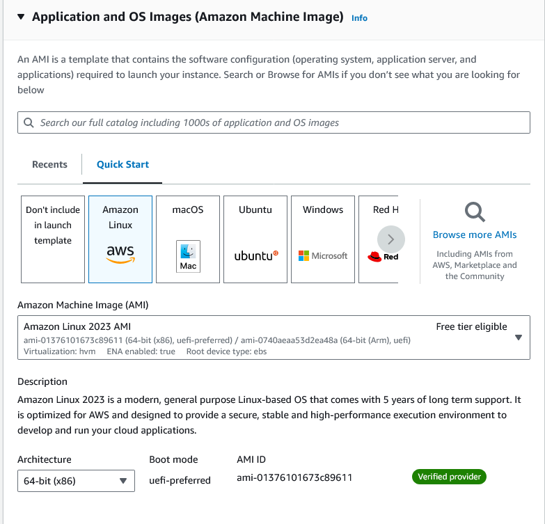
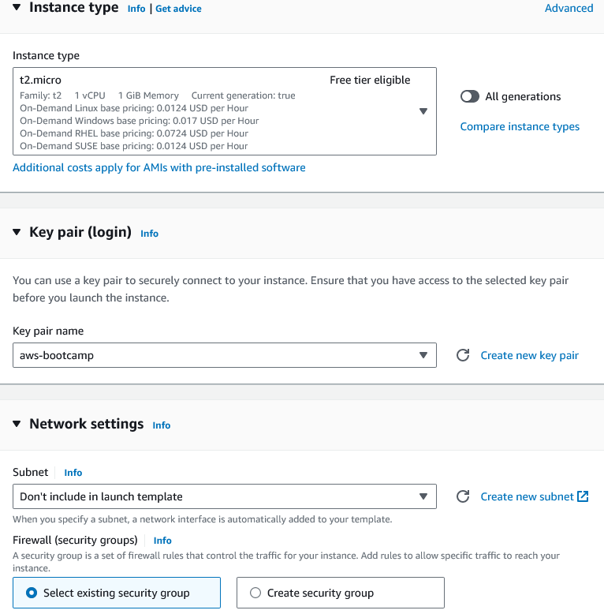
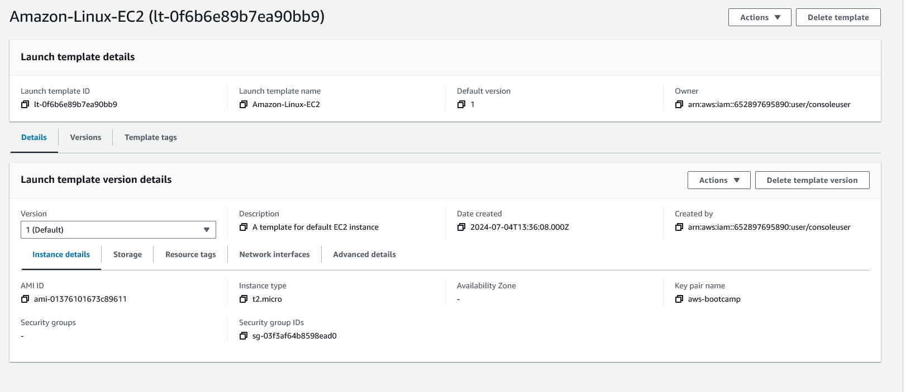

# Creating a Launch template

1. Fill the details in the EC2 --> Launch Templates --> Create Launch template

2. You should always use tags to identify the resources. It is also possible to create a Launch template inherit its configuraion from others.

3. Select an AMI

4. Select an instance type, key-pair for SSH login and network configuration. Configure storage volume if required.

5. Click on create launch template. You can also configure any other settings in the Advanced details tab. Once created, this launch template can be used in configuring ASG and Spot requests.

