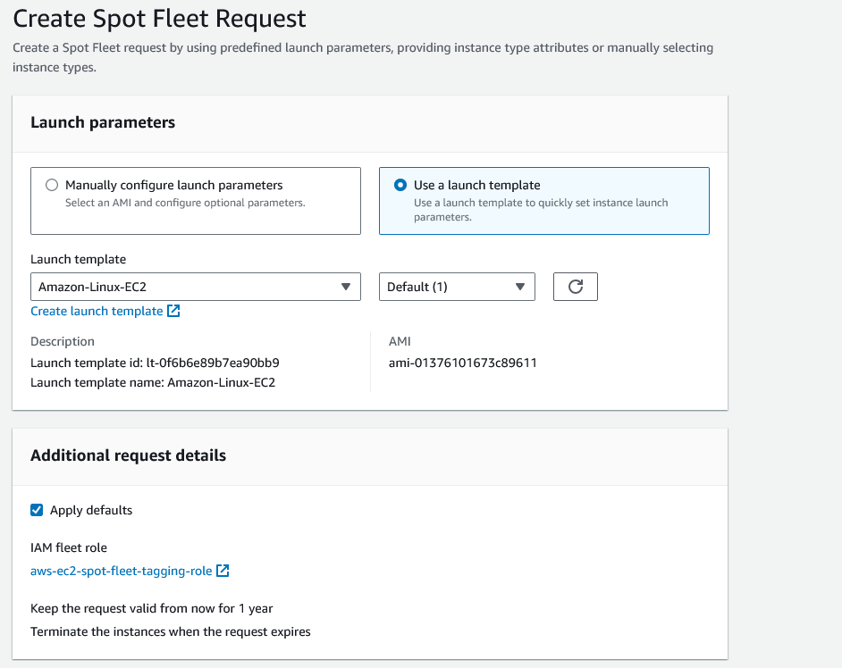
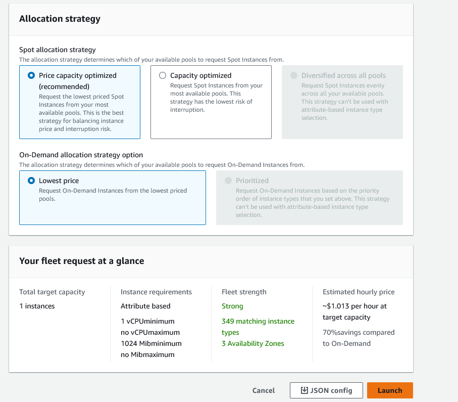

# Creating a spot instance fleet 

1. Once you have a launch template, you can create a spot instance fleet.

2. You can specify a launch template that is used to create the spot instance fleet, and you can specify the instance types that are used to create the spot instance fleet.

3. In the Target capacity, you can specify the total target capacity and maximum cost.

4. Next is network and instance type requirements that can be specified to customize the spot instances

5. Allocation strategy will help you specify how to allocate the spot instances.

6. Once you have created the fleet, you can start and stop the spot instances.

