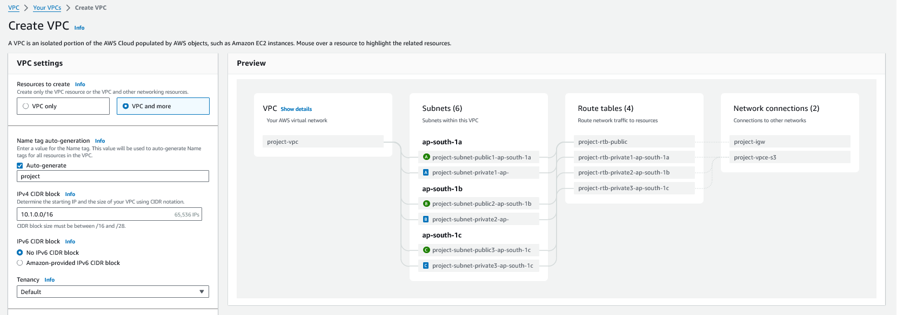
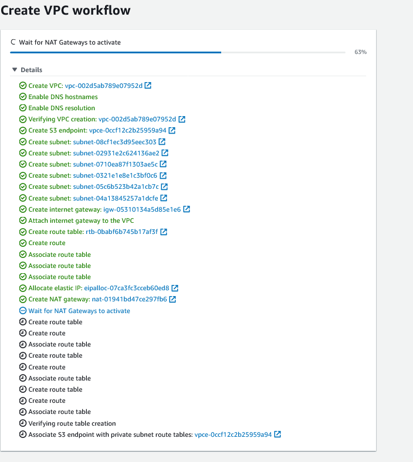
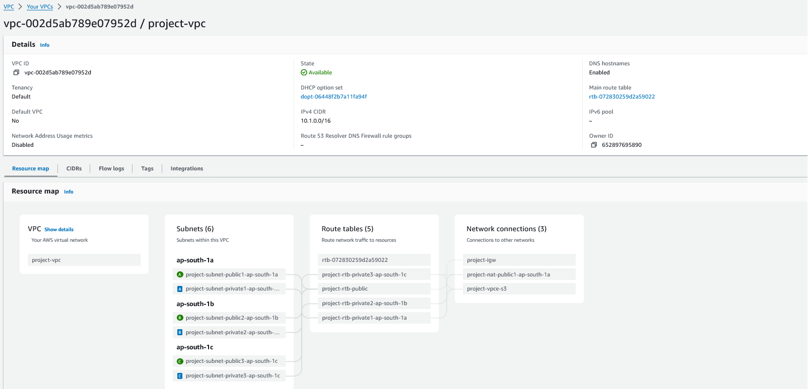

# Create a new VPC

1. Subnetting 

Decide the subnets that you are going to use to create a VPC 
I prefer to use this excellent [tool ](https://www.davidc.net/sites/default/subnets/subnets.html) to visualize my subnets. I am going to use the subnet `10.1.0.0/16` for my VPC .

I have created the following subnets

| Subnet address | Range of addresses | Useable IPs | Hosts | Remarks | Comments |
|----------------|--------------------|-------------|-------|--------|------|
| 10.1.0.0/20 | 10.1.0.0 - 10.1.15.255 | 10.1.0.1 - 10.1.15.254 | 4094 | Public Subnet - AZ A |  |
| 10.1.16.0/20 | 10.1.16.0 - 10.1.31.255 | 10.1.16.1 - 10.1.31.254 | 4094 | Public Subnet - AZ B |  |
| 10.1.32.0/20 | 10.1.32.0 - 10.1.47.255 | 10.1.32.1 - 10.1.47.254 | 4094 | Public Subnet - AZ C |  |
| 10.1.48.0/20 | 10.1.48.0 - 10.1.63.255 | 10.1.48.1 - 10.1.63.254 | 4094 | Private Subnet - AZ A  |  |
| 10.1.64.0/20 | 10.1.64.0 - 10.1.79.255 | 10.1.64.1 - 10.1.79.254 | 4094 | Private Subnet - AZ B |  |
| 10.1.80.0/20 | 10.1.80.0 - 10.1.95.255 | 10.1.80.1 - 10.1.95.254 | 4094 | Private Subnet - AZ C |  |
| 10.1.96.0/20 | 10.1.96.0 - 10.1.111.255 | 10.1.96.1 - 10.1.111.254 | 4094 | Future use |  |
| 10.1.112.0/20 | 10.1.112.0 - 10.1.127.255 | 10.1.112.1 - 10.1.127.254 | 4094 | Future use |  |
| 10.1.128.0/20 | 10.1.128.0 - 10.1.143.255 | 10.1.128.1 - 10.1.143.254 | 4094 | Future use |  |
| 10.1.144.0/20 | 10.1.144.0 - 10.1.159.255 | 10.1.144.1 - 10.1.159.254 | 4094 | Future use |  |
| 10.1.160.0/20 | 10.1.160.0 - 10.1.175.255 | 10.1.160.1 - 10.1.175.254 | 4094 | Future use |  |
| 10.1.176.0/20 | 10.1.176.0 - 10.1.191.255 | 10.1.176.1 - 10.1.191.254 | 4094 | Future use |  |
| 10.1.192.0/20 | 10.1.192.0 - 10.1.207.255 | 10.1.192.1 - 10.1.207.254 | 4094 | Future use |  |
| 10.1.208.0/20 | 10.1.208.0 - 10.1.223.255 | 10.1.208.1 - 10.1.223.254 | 4094 | Future use |  |
| 10.1.224.0/20 | 10.1.224.0 - 10.1.239.255 | 10.1.224.1 - 10.1.239.254 | 4094 | Future use |  |
| 10.1.240.0/20 | 10.1.240.0 - 10.1.255.255 | 10.1.240.1 - 10.1.255.254 | 4094 | Future use |

A subnet is a subdivision of an IP network. It is defined by a network address and a prefix length. The prefix length determines the size of the subnet. For example, a subnet with a prefix length of 24 is a /24 subnet and can have 256 IP addresses available.

Subnetting is the process of dividing a larger network into smaller subnets. This is done to reduce the number of IP addresses available in a network and to create logical groupings of IP addresses.

To subnet a network, you need to determine the number of subnets you want to create and the number of hosts you want to allocate to each subnet. The number of subnets is determined by the number of IP addresses you want to allocate to each subnet. The number of hosts you want to allocate to each subnet is determined by the number of devices you want to connect to the network.

After determining the number of subnets and the number of hosts per subnet, you can use the following formula to calculate the prefix length for each subnet:

Prefix Length = Network Bits + (Number of Subnets - 1) + (Number of Host Bits - 2)

For example, if you have a /16 network and you want to create 4 subnets, with 16 IP addresses allocated to each subnet, you would use the following formula:

Prefix Length = 16 + (4 - 1) + (4 - 2) = 20

This means that the subnets would be /20 subnets.

2. Create a VPC using the VPC workflow

3. Once all the details are provided the VPC will be created

4. View the created VPC

