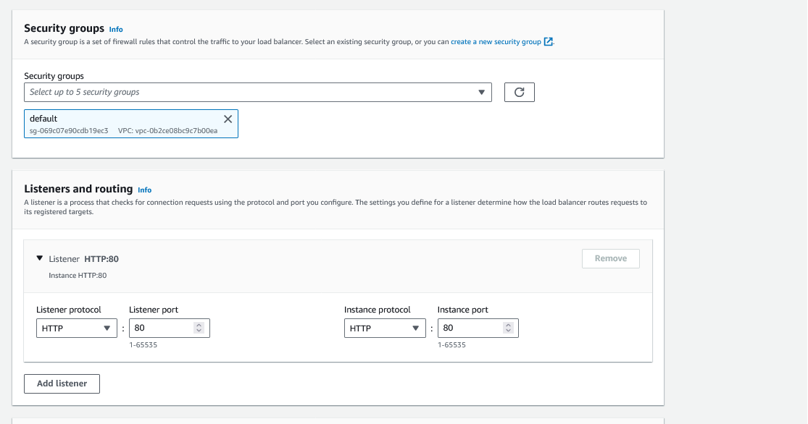

# Classic Load balancer

You can still create a classic load balancer using the AWS console.

1. Fill out the form with the details of the load balancer you want to create.


2. Define the network mapping


3. Configure the listeners


4. Configure the health checks



5. Validate if you need cross-zone load balancing.

```
With cross-zone load balancing, each load balancer node for your Classic Load Balancer distributes requests evenly across the registered instances in all enabled Availability Zones. If cross-zone load balancing is disabled, each load balancer node distributes requests evenly across the registered instances in its Availability Zone only. Classic Load Balancers created with the API or CLI have cross-zone load balancing disabled by default. After you create a Classic Load Balancer, you can enable or disable cross-zone load balancing at any time.
```


6. Review the configuration.