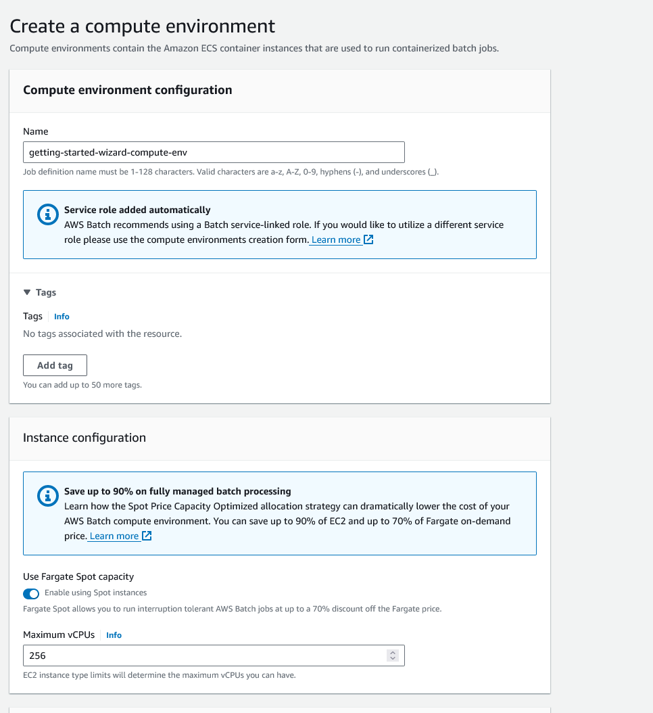
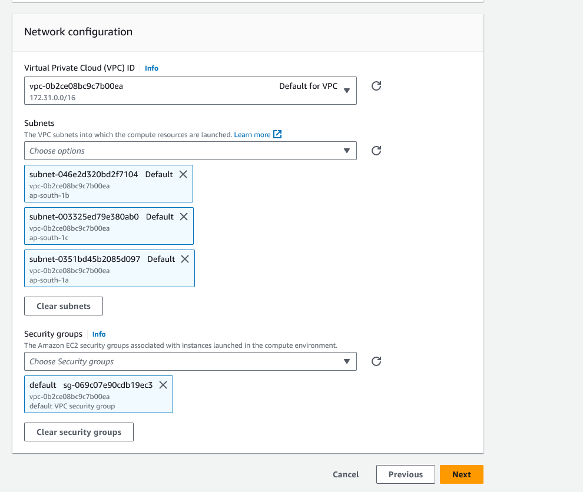
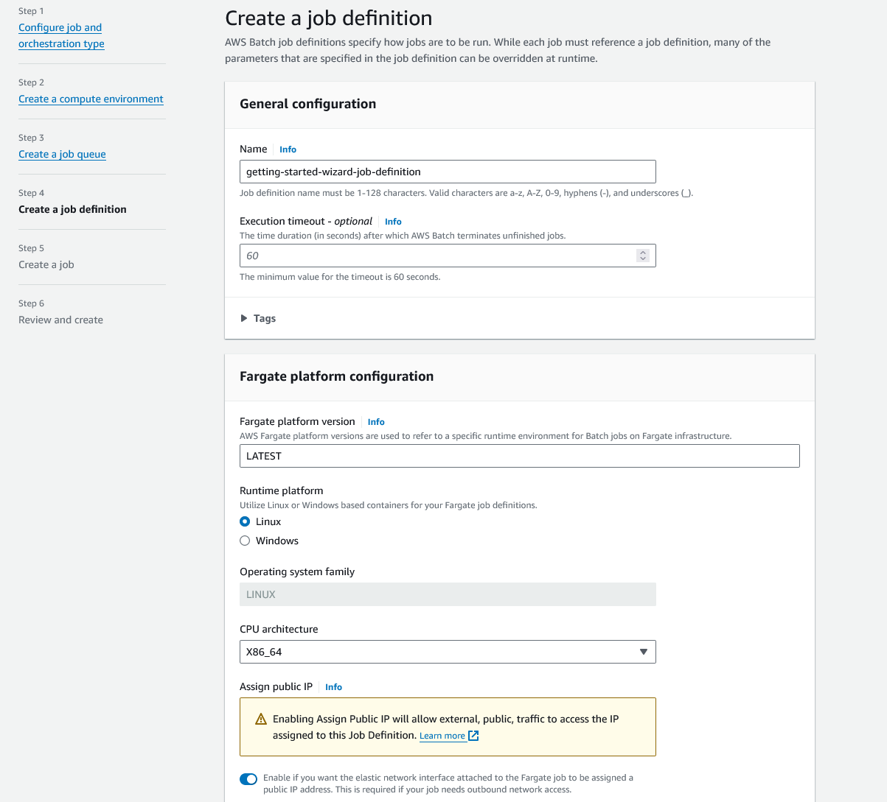
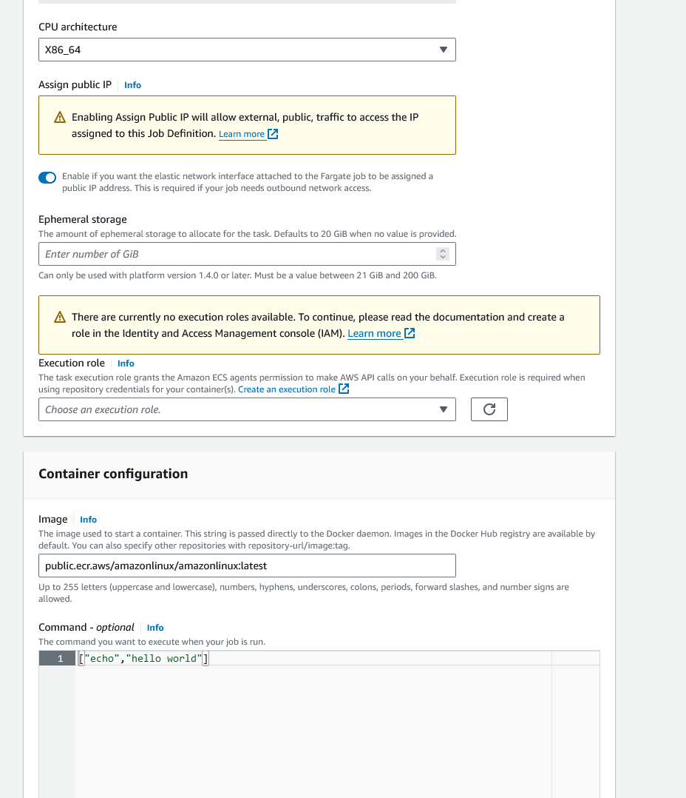
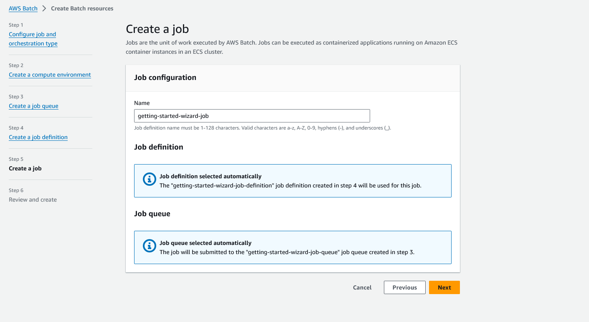

# AWS Batch

1. Create a AWS Resource where your batch jobs will operate


2. Create a new compute environment



3. Select the required network configuration




4. Once the resources are created, now we have to create a job queue


5. Now you can create a job description






Note, you need an execution role


with the following policy

```json

{
	"Version": "2012-10-17",
	"Statement": [
		{
			"Effect": "Allow",
			"Principal": {
				"Service": "ecs-tasks.amazonaws.com"
			},
			"Action": "sts:AssumeRole"
		}
	]
}


```

6. Now you can create the job

