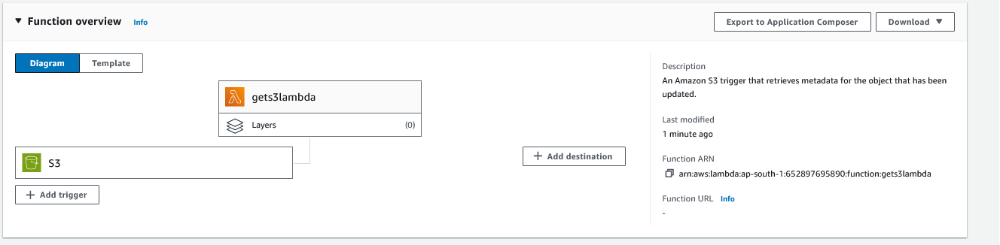
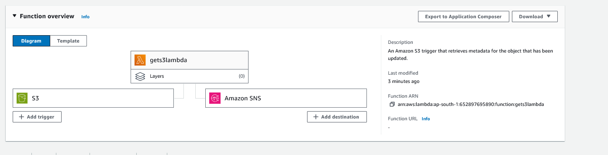
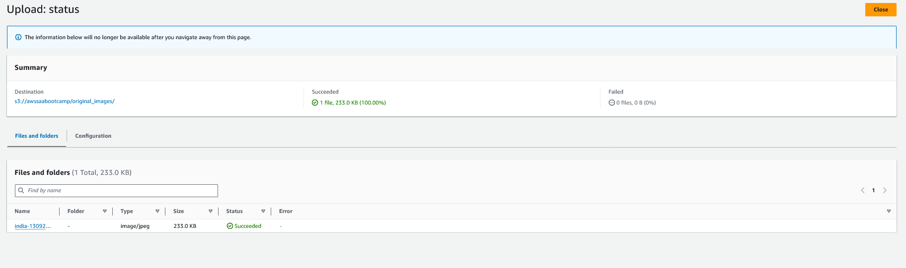

# AWS Lambda with S3 and SNS

1. Create a lambda function. We are going to use the blueprint already provide by AWS

2. The lambda function would need a role to access S3. We are going to create a new role by template provided by AWS

3. The lambda function is a Python code that can be modified

4. Configure the trigger or event from the producer. We are going to "listen" to event generated by S3 on `PUT` requests for any `*.jpg` file in `images/` prefix.

5. The source trigger is configured and the function should look like images

6. Add the SNS topic 

7. Final configuration should look like this 

8. If you upload a file on the bucket you should get an email notification

9. To cleanup, delete the Lambda function, S3 bucket and SNS topic