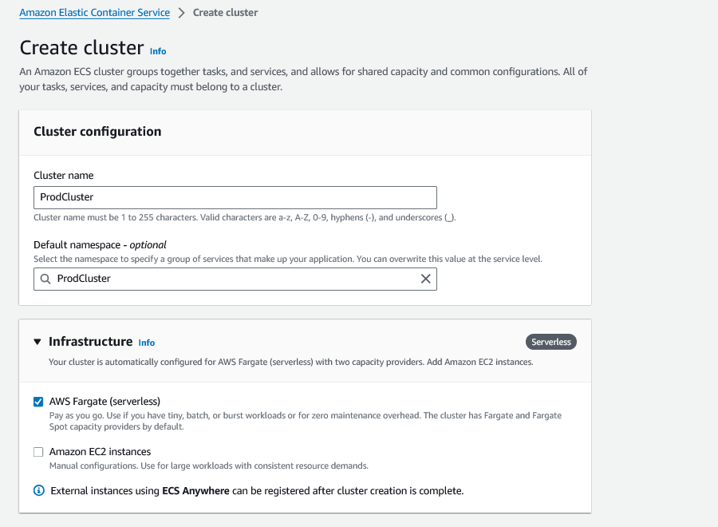
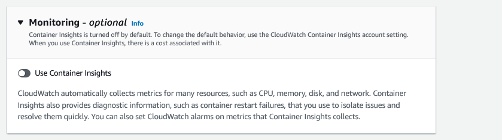
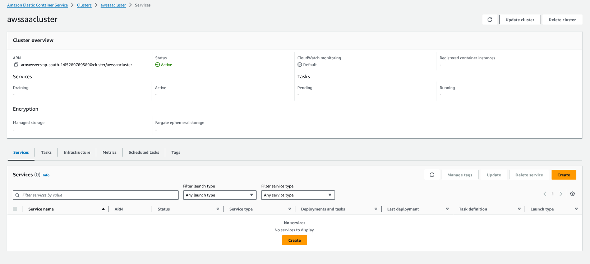
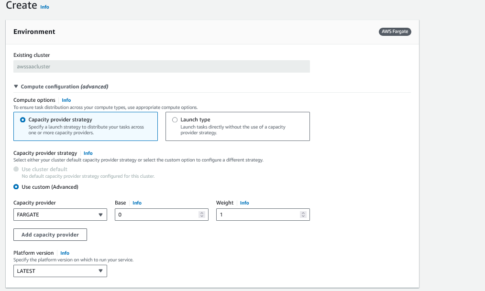
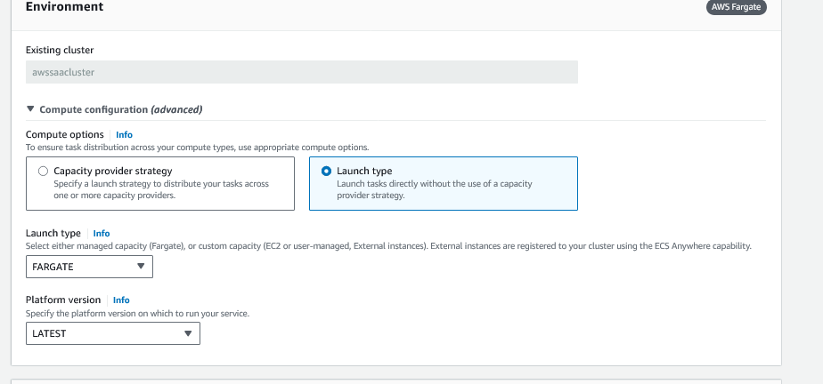
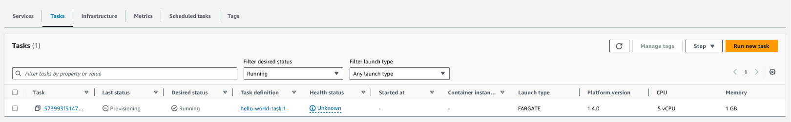
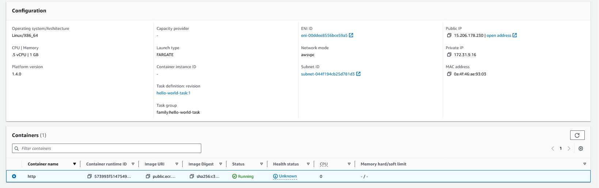

# ECS Fargate

1. Create an ECS Cluster, make sure you create a cluster by selecting `AWS Fargate`

2. If you need to collect container logs in CloudWatch, you can configure the cluster to collect them

3. Select encryption for prod level clusters and make sure you have the `ecs:TagResource` permission to the roles who want to create tasks if the tagging is enabled in the cluster

4. Create a `task definition`

5. Select the `arch` type, CPU/Memory configuration

6. Configure the container

6. Create a `service`

7. Select the compute type, we are going to select Launch type as Fargate

8. Create the Task

8. Have the IP configuration

9. The task will spin up

10. Check the webpage

11. To cleanup delete the cluster, service, task and the task definition
