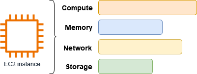

# Amazon Elastic Compute cloud (EC2)

## Introduction
- Amazon Elastic Compute Cloud (Amazon EC2) provides on-demand, scalable computing capacity in the Amazon Web Services (AWS) Cloud

---
 
## EC2 Instances vs. Virtual Machines

| Term | EC2 Instances (AWS) | Virtual Machines (General) |
|---|---|---|
| Instances | Virtual servers in the Amazon Elastic Compute Cloud (EC2). | A software program that simulates a physical computer system. |
| Amazon Machine Images (AMIs) | Preconfigured templates for EC2 instances that include the operating system and software. | Similar to the Images in a virtual machine. |
| Instance Types | Various configurations of hardware resources (CPU, memory, storage, networking) for EC2 instances. | Hardware configuration settings for a virtual machine. |
| Amazon EBS Volumes | Persistent block storage for EC2 instances, separate from the instance itself. | Not specific to virtual machines, but can be used for persistent storage attached to a virtual machine. |
| Instance Store Volumes | Temporary block storage for EC2 instances, deleted when the instance stops. | Temporary storage attached to a virtual machine, typically lost when the virtual machine is powered off.  |
| Key Pairs | Secure login credentials for EC2 instances (public key stored by AWS, private key stored by user). | Various authentication methods can be used for virtual machines, key pairs are a common option. |
| Security Groups | Virtual firewalls that control network traffic to and from EC2 instances. | Firewalls can be used to control network traffic to and from virtual machines. |

**Notes:**

* EC2 instances are a specific type of virtual machine offered by Amazon Web Services (AWS).
* Both EC2 instances and virtual machines can run various operating systems and software.
* Some of the additional features listed (AMIs, EBS volumes, etc.) are specific to AWS EC2 instances.

## Services to use with Amazon EC2

| Service | Description |
|---|---|
| Amazon EC2 Auto Scaling | Ensures you have the right number of EC2 instances to handle your application load. |
| AWS Backup | Automates backups of your EC2 instances and attached EBS volumes. |
| Amazon CloudWatch | Monitors your EC2 instances and EBS volumes. |
| Elastic Load Balancing | Distributes incoming application traffic across multiple instances. |
| Amazon GuardDuty | Detects unauthorized or malicious use of your EC2 instances. |
| EC2 Image Builder | Automates creation, management, and deployment of secure and up-to-date server images. | 
| AWS Launch Wizard | Assists in sizing, configuring, and deploying AWS resources for third-party applications. |
| AWS Systems Manager | Provides a secure solution for performing operations on EC2 instances at scale. |

## The most popular ways to EC2 instance

| Tool | Description | Benefits |
|---|---|---|
| Amazon EC2 console | Web interface for managing EC2 instances and resources. | Easy to use, good for basic tasks. |
| AWS Command Line Interface (AWS CLI) | Command-line tool for interacting with AWS services. | Powerful, automatable, works on Windows, Mac, and Linux. |
| AWS CloudFormation | Infrastructure as code tool for provisioning EC2 resources. | Reusable templates, consistent configurations, multi-region deployment. |
| AWS SDKs | Language-specific libraries for building applications with AWS services. | Simplified development experience, pre-built functions for common tasks. |

###  Other ways

| Tool | Description | Benefits |
|---|---|---|
| AWS Tools for PowerShell | PowerShell modules for scripting EC2 operations. | Automates tasks, integrates with existing PowerShell workflows. |  
| Query API | API for programmatic access to EC2 resources using HTTP requests. | Fine-grained control, automatable from various programming languages. |

## Flexible pricing model

## Amazon EC2 Pricing Models

| Model | Description | Benefits |
|---|---|---|
| Free Tier | Free usage for eligible services for a limited time. | Good for experimentation and learning. |
| On-Demand Instances | Pay per second for the instances you use. | Flexible, no upfront commitment. |
| Savings Plans | Discounted hourly rate for committed usage. | Lower cost for predictable workloads. |
| Reserved Instances |  Significant discounts for reserved configurations over 1 or 3 years. | Ideal for consistent workloads. |
| Spot Instances | Pay variable, market-based prices for unused instances. | Can offer substantial cost savings. |
| Dedicated Hosts | Dedicated physical server for your use, On-Demand or with Savings Plan.  |  Use existing software licenses, meet compliance needs. |
| On-Demand Capacity Reservations  | Reserve compute capacity in a specific zone for any time. | Ensures capacity for spiky workloads. |
| Per-Second Billing | Eliminates unused minute and second charges. | Optimizes costs for bursty workloads. |

##  Components for Launching an EC2 Instance

| Component | Description |
|---|---|
| Image |  A template containing the software for your instance (e.g., operating system). |
| Key Pair | Security credentials for connecting to your instance (public key on instance, private key on your computer). |
| Network | A virtual private cloud (VPC) dedicated to your AWS account (default VPC with subnet in each Availability Zone). |
| Security Group | Virtual firewall controlling inbound and outbound traffic. |
| EBS Volume |  Storage for your instance (required root volume, optional data volumes). |

### Best practices for Amazon EC2

## AWS EC2 Security Best Practices

| Category | Description |
|---|---|
| **Identity and Access Management (IAM)** |  - Use IAM roles for access control whenever possible.   - Implement least permissive security group rules. |
| **Operating System and Application Security** | - Regularly patch and update your instance's OS and applications. |
| **Vulnerability Scanning** |  - Use Amazon Inspector to scan for vulnerabilities and unintended network exposure.   - Use AWS Security Hub controls to monitor against best practices and security standards. |
| **Storage** |  - Understand implications of root device type for data persistence, backup, and recovery.   - Use separate EBS volumes for OS and data (data volume persists after termination).   - Use instance store for temporary data only (data is deleted when instance stops/terminates).   - Encrypt EBS volumes and snapshots. |
| **Resource Management** |  - Use instance metadata and tags to track and identify resources.   - Be aware of and plan for service quotas.   - Use AWS Trusted Advisor for recommendations on cost savings, performance, and security. |
| **Backup and Recovery** |  - Regularly backup EBS volumes with snapshots and create AMIs for future deployments.    - Deploy critical components across multiple Availability Zones and replicate data.   - Design applications to handle dynamic IP addressing.   - Monitor and respond to events.   -  Have a failover plan (manual or with EC2 Auto Scaling).   - Regularly test your recovery process. |
| **Networking** | - Set the time-to-live (TTL) value for applications to 255 (IPv4 & IPv6) to avoid reachability issues. |

