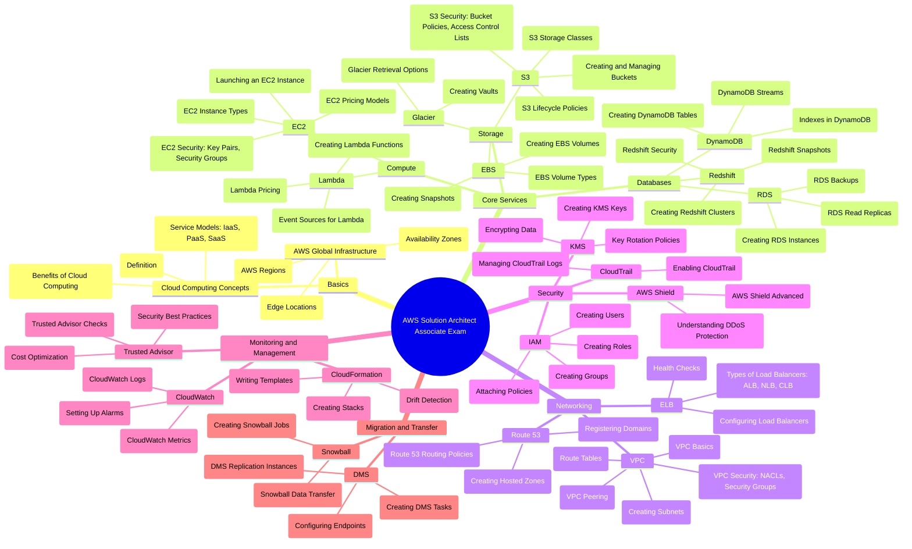

```mermaid
mindmap
  root((AWS Solution Architect Associate Exam))
    Basics
      Cloud Computing Concepts
        definition(Definition)
        models(Service Models: IaaS, PaaS, SaaS)
        benefits(Benefits of Cloud Computing)
      AWS Global Infrastructure
        regions(AWS Regions)
        availabilityZones(Availability Zones)
        edgeLocations(Edge Locations)
    Core Services
      Compute
        EC2
          ec2Types(EC2 Instance Types)
          launch(Launching an EC2 Instance)
          pricing(EC2 Pricing Models)
          security(EC2 Security: Key Pairs, Security Groups)
        Lambda
          functions(Creating Lambda Functions)
          triggers(Event Sources for Lambda)
          pricing(Lambda Pricing)
      Storage
        S3
          buckets(Creating and Managing Buckets)
          storageClasses(S3 Storage Classes)
          lifecycle(S3 Lifecycle Policies)
          security(S3 Security: Bucket Policies, Access Control Lists)
        EBS
          volumes(Creating EBS Volumes)
          types(EBS Volume Types)
          snapshots(Creating Snapshots)
        Glacier
          vaults(Creating Vaults)
          retrieval(Glacier Retrieval Options)
      Databases
        RDS
          dbInstances(Creating RDS Instances)
          backups(RDS Backups)
          readReplicas(RDS Read Replicas)
        DynamoDB
          tables(Creating DynamoDB Tables)
          indexes(Indexes in DynamoDB)
          streams(DynamoDB Streams)
        Redshift
          clusters(Creating Redshift Clusters)
          snapshots(Redshift Snapshots)
          security(Redshift Security)
    Networking
      VPC
        vpcBasics(VPC Basics)
        subnets(Creating Subnets)
        routing(Route Tables)
        security(VPC Security: NACLs, Security Groups)
        peering(VPC Peering)
      Route 53
        domains(Registering Domains)
        hostedZones(Creating Hosted Zones)
        routingPolicies(Route 53 Routing Policies)
      ELB
        types(Types of Load Balancers: ALB, NLB, CLB)
        configuration(Configuring Load Balancers)
        healthChecks(Health Checks)
    Security
      IAM
        users(Creating Users)
        groups(Creating Groups)
        roles(Creating Roles)
        policies(Attaching Policies)
      KMS
        keys(Creating KMS Keys)
        encryption(Encrypting Data)
        rotation(Key Rotation Policies)
      CloudTrail
        logging(Enabling CloudTrail)
        management(Managing CloudTrail Logs)
      AWS Shield
        ddos(Understanding DDoS Protection)
        advanced(AWS Shield Advanced)
    Monitoring and Management
      CloudWatch
        metrics(CloudWatch Metrics)
        alarms(Setting Up Alarms)
        logs(CloudWatch Logs)
      CloudFormation
        stacks(Creating Stacks)
        templates(Writing Templates)
        drift(Drift Detection)
      Trusted Advisor
        checks(Trusted Advisor Checks)
        costOptimization(Cost Optimization)
        security(Security Best Practices)
    Migration and Transfer
      DMS
        tasks(Creating DMS Tasks)
        endpoints(Configuring Endpoints)
        replication(DMS Replication Instances)
      Snowball
        jobs(Creating Snowball Jobs)
        dataTransfer(Snowball Data Transfer)

```